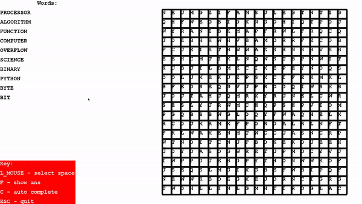

# Wordsearch

## Dependencies
`python 3.6+`, `pygame`, `pyautogui`

## Example


## Instructions
* Download all files other than wordsearch_hw (words.txt required) and run wordsearch_gui to play
* Made for 1920x1080 displays

## Using Creator and Solver
Make wordsearch:
```python
c = Creator(20, 20, word_name="words.txt", out_to_file=True)
```
Makes 20x20 grid using the words from text file `words.txt` and creates puzzle file, the puzzle file is a text file with the letters
of the wordsearch seperated by spaces and in capitalised

Solve wordseatch:
```python
s = Solver("words.txt", puz_file="puz.txt")
```
Solves the wordsearch in the puzzle file provided, can call `s.out_to_file()` to output the solve progressions to a file to see visually
